# Laporan Hasil Testing Model Deteksi Pohon Kelapa Sawit

## Perbandingan Lengkap: Legacy vs v2 (Combined, DAMIMAS, LONSUM)

**Tanggal Pengujian:** Maret 2026
**Dataset Test:** `dataset_combined_test` — 592 gambar, 20 background, 4 kelas (B1–B4)
**Jumlah Model Diuji:** 14 model

---

## Daftar Isi

1. [Pendahuluan](#1-pendahuluan)
2. [Metodologi Testing](#2-metodologi-testing)
3. [Ringkasan Metrik Global](#3-ringkasan-metrik-global)
4. [Analisis Per Grup Model](#4-analisis-per-grup-model)
5. [Analisis Performa Per Jenis Pohon (B1–B4)](#5-analisis-performa-per-jenis-pohon-b1b4)
6. [Perbandingan Legacy vs v2](#6-perbandingan-legacy-vs-v2)
7. [Kurva F1, PR, dan Confusion Matrix](#7-kurva-f1-pr-dan-confusion-matrix)
8. [Visualisasi Prediksi](#8-visualisasi-prediksi)
9. [Kesimpulan dan Rekomendasi](#9-kesimpulan-dan-rekomendasi)

---

## 1. Pendahuluan

Laporan ini menyajikan hasil evaluasi menyeluruh terhadap 14 model deteksi pohon kelapa sawit berbasis YOLO. Model-model ini dikelompokkan menjadi:

- **Combined v2** — Dilatih dengan dataset gabungan DAMIMAS + LONSUM (4 varian)
- **DAMIMAS v2** — Dilatih khusus dengan dataset DAMIMAS (4 varian)
- **LONSUM v2** — Dilatih khusus dengan dataset LONSUM (4 varian)
- **Legacy** — Model generasi sebelumnya (2 varian)

Setiap grup v2 memiliki 4 varian dari kombinasi:
- **Arsitektur:** YOLOv9c (`yv9c`) vs YOLO26L (`y26l`)
- **Seed:** 42 vs 123

Keempat kelas deteksi:
| Kelas | Deskripsi |
|-------|-----------|
| **B1** | Pohon kelapa sawit kategori Besar 1 (paling mudah dikenali) |
| **B2** | Pohon kelapa sawit kategori Besar 2 |
| **B3** | Pohon kelapa sawit kategori Besar 3 |
| **B4** | Pohon kelapa sawit kategori Besar 4 (paling sulit dikenali) |

---

## 2. Metodologi Testing

- Semua 14 model dievaluasi pada **dataset test yang sama** (`dataset_combined_test`) untuk perbandingan yang fair
- Evaluasi menggunakan metrik standar YOLO: **Precision (P)**, **Recall (R)**, **mAP@50**, **mAP@50-95**
- Confusion matrix ternormalisasi digunakan untuk analisis per-kelas
- Image size: 640px (default YOLO)

---

## 3. Ringkasan Metrik Global

### Tabel Perbandingan Semua Model

| # | Model | Arsitektur | Seed | P | R | mAP50 | mAP50-95 |
|---|-------|-----------|------|------|------|-------|----------|
| 1 | combined_y26l_123 | YOLO26L | 123 | 0.449 | 0.538 | 0.461 | 0.214 |
| 2 | combined_y26l_42 | YOLO26L | 42 | 0.448 | 0.537 | 0.457 | 0.203 |
| 3 | **combined_yv9c_123** | YOLOv9c | 123 | **0.486** | 0.588 | **0.505** | **0.230** |
| 4 | combined_yv9c_42 | YOLOv9c | 42 | 0.482 | **0.611** | 0.504 | 0.226 |
| 5 | damimas_y26l_123 | YOLO26L | 123 | 0.454 | 0.539 | 0.469 | 0.220 |
| 6 | damimas_y26l_42 | YOLO26L | 42 | 0.446 | 0.547 | 0.465 | 0.203 |
| 7 | damimas_yv9c_123 | YOLOv9c | 123 | 0.483 | 0.613 | 0.500 | 0.224 |
| 8 | **damimas_yv9c_42** | YOLOv9c | 42 | **0.502** | 0.590 | **0.505** | **0.230** |
| 9 | lonsum_y26l_123 | YOLO26L | 123 | 0.313 | 0.294 | 0.232 | 0.091 |
| 10 | lonsum_y26l_42 | YOLO26L | 42 | 0.281 | 0.267 | 0.211 | 0.081 |
| 11 | lonsum_yv9c_123 | YOLOv9c | 123 | 0.289 | 0.300 | 0.257 | 0.091 |
| 12 | lonsum_yv9c_42 | YOLOv9c | 42 | 0.366 | 0.370 | 0.307 | 0.119 |
| 13 | **legacy_yv9c_640** | YOLOv9c | - | 0.467 | 0.587 | 0.483 | 0.161 |
| 14 | legacy_y26l_1280_damimas | YOLO26L | - | 0.398 | 0.470 | 0.405 | 0.137 |

### Ranking Model Berdasarkan mAP50

| Rank | Model | mAP50 | mAP50-95 |
|------|-------|-------|----------|
| 1 | **combined_yv9c_123** | **0.505** | **0.230** |
| 2 | **damimas_yv9c_42** | **0.505** | **0.230** |
| 3 | combined_yv9c_42 | 0.504 | 0.226 |
| 4 | damimas_yv9c_123 | 0.500 | 0.224 |
| 5 | legacy_yv9c_640 | 0.483 | 0.161 |
| 6 | damimas_y26l_123 | 0.469 | 0.220 |
| 7 | damimas_y26l_42 | 0.465 | 0.203 |
| 8 | combined_y26l_123 | 0.461 | 0.214 |
| 9 | combined_y26l_42 | 0.457 | 0.203 |
| 10 | legacy_y26l_1280_damimas | 0.405 | 0.137 |
| 11 | lonsum_yv9c_42 | 0.307 | 0.119 |
| 12 | lonsum_yv9c_123 | 0.257 | 0.091 |
| 13 | lonsum_y26l_123 | 0.232 | 0.091 |
| 14 | lonsum_y26l_42 | 0.211 | 0.081 |

---

## 4. Analisis Per Grup Model

### 4.1 Combined v2 (Dataset Gabungan DAMIMAS + LONSUM)

| Model | P | R | mAP50 | mAP50-95 |
|-------|------|------|-------|----------|
| combined_yv9c_123 | 0.486 | 0.588 | **0.505** | **0.230** |
| combined_yv9c_42 | 0.482 | **0.611** | 0.504 | 0.226 |
| combined_y26l_123 | 0.449 | 0.538 | 0.461 | 0.214 |
| combined_y26l_42 | 0.448 | 0.537 | 0.457 | 0.203 |

**Temuan:**
- YOLOv9c secara konsisten mengungguli YOLO26L (~4–5% lebih tinggi pada mAP50)
- Seed 123 sedikit lebih baik dari seed 42 pada YOLOv9c
- Recall tertinggi grup ini: **0.611** (combined_yv9c_42)
- Rata-rata mAP50 grup: **0.482**

### 4.2 DAMIMAS v2 (Dataset DAMIMAS Only)

| Model | P | R | mAP50 | mAP50-95 |
|-------|------|------|-------|----------|
| damimas_yv9c_42 | **0.502** | 0.590 | **0.505** | **0.230** |
| damimas_yv9c_123 | 0.483 | **0.613** | 0.500 | 0.224 |
| damimas_y26l_123 | 0.454 | 0.539 | 0.469 | 0.220 |
| damimas_y26l_42 | 0.446 | 0.547 | 0.465 | 0.203 |

**Temuan:**
- Precision tertinggi di antara semua grup: **0.502** (damimas_yv9c_42)
- Performa setara dengan Combined meskipun dilatih hanya pada data DAMIMAS
- Ini menunjukkan data DAMIMAS memiliki kualitas/representasi yang baik
- Rata-rata mAP50 grup: **0.485**

### 4.3 LONSUM v2 (Dataset LONSUM Only)

| Model | P | R | mAP50 | mAP50-95 |
|-------|------|------|-------|----------|
| lonsum_yv9c_42 | **0.366** | **0.370** | **0.307** | **0.119** |
| lonsum_y26l_123 | 0.313 | 0.294 | 0.232 | 0.091 |
| lonsum_yv9c_123 | 0.289 | 0.300 | 0.257 | 0.091 |
| lonsum_y26l_42 | 0.281 | 0.267 | 0.211 | 0.081 |

**Temuan:**
- **Performa paling rendah** di semua grup — jauh tertinggal
- mAP50 terbaik hanya **0.307** (kurang dari setengah performa Combined/DAMIMAS)
- Model LONSUM kesulitan generalisasi ke test set gabungan
- Kemungkinan besar karena distribusi data LONSUM sangat berbeda dari DAMIMAS
- Rata-rata mAP50 grup: **0.252**

### 4.4 Legacy

| Model | P | R | mAP50 | mAP50-95 |
|-------|------|------|-------|----------|
| legacy_yv9c_640 | **0.467** | **0.587** | **0.483** | 0.161 |
| legacy_y26l_1280_damimas | 0.398 | 0.470 | 0.405 | 0.137 |

**Temuan:**
- `legacy_yv9c_640` masih kompetitif di mAP50 (0.483), namun **mAP50-95 jauh lebih rendah** (0.161 vs 0.230 v2)
- Ini berarti legacy mendeteksi objek tetapi bounding box kurang presisi
- `legacy_y26l_1280_damimas` tertinggal di semua metrik

---

## 5. Analisis Performa Per Jenis Pohon (B1–B4)

Data berikut diekstrak dari confusion matrix ternormalisasi (diagonal = recall per kelas).

### 5.1 Tabel Recall Per Kelas (Dari Confusion Matrix)

| Model | B1 | B2 | B3 | B4 | Miss→BG |
|-------|-----|-----|-----|-----|---------|
| combined_y26l_123 | 0.77 | 0.29 | 0.43 | 0.16 | B4: 0.59 |
| combined_y26l_42 | 0.74 | 0.35 | 0.41 | 0.20 | B4: 0.57 |
| combined_yv9c_123 | 0.78 | 0.37 | 0.42 | 0.24 | B4: 0.47 |
| combined_yv9c_42 | 0.72 | 0.31 | 0.47 | 0.28 | B4: 0.48 |
| damimas_y26l_123 | 0.72 | 0.21 | 0.33 | 0.18 | B4: 0.68 |
| damimas_y26l_42 | 0.70 | 0.32 | 0.37 | 0.20 | B4: 0.62 |
| damimas_yv9c_123 | 0.77 | 0.38 | 0.41 | 0.15 | B4: 0.56 |
| damimas_yv9c_42 | 0.78 | 0.38 | 0.39 | 0.14 | B4: 0.59 |
| lonsum_y26l_123 | 0.19 | 0.05 | 0.26 | 0.03 | B4: 0.86 |
| lonsum_y26l_42 | 0.25 | 0.03 | 0.29 | 0.02 | B4: 0.85 |
| lonsum_yv9c_123 | 0.64 | 0.06 | 0.26 | 0.05 | B4: 0.87 |
| lonsum_yv9c_42 | 0.50 | 0.05 | 0.36 | 0.07 | B4: 0.73 |
| legacy_yv9c_640 | **0.80** | 0.28 | **0.48** | 0.16 | B4: 0.63 |
| legacy_y26l_1280_damimas | 0.71 | 0.24 | 0.35 | 0.12 | B4: 0.77 |

### 5.2 Analisis Per Jenis Pohon

#### B1 (Pohon Besar — Easiest)

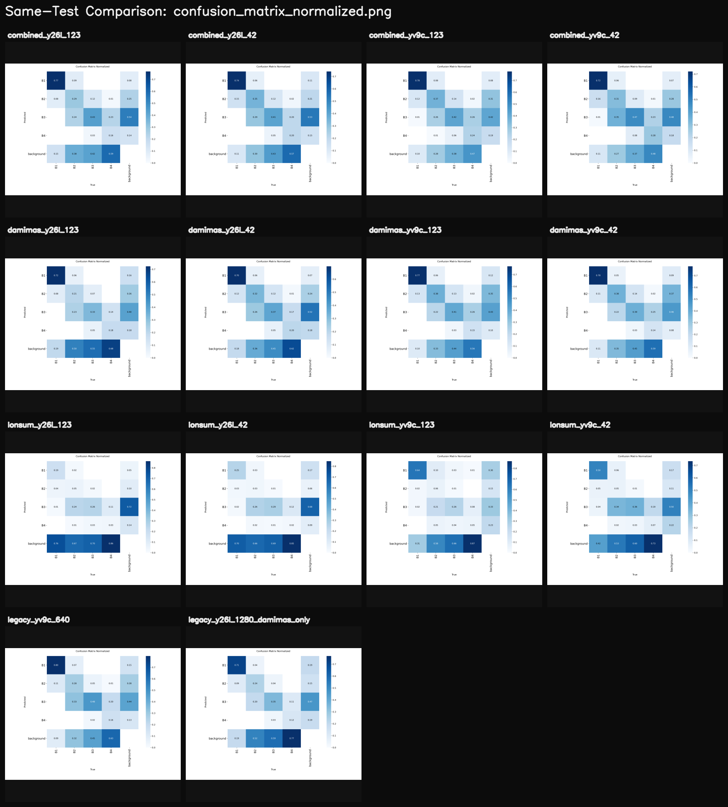

- **Kelas paling mudah dideteksi** di semua model
- Recall rata-rata Combined/DAMIMAS: **0.72–0.78**
- `legacy_yv9c_640` memimpin: **0.80**
- LONSUM sangat rendah: 0.19–0.64 (karena domain gap)
- **Kesimpulan:** Semua model v2 non-LONSUM mampu mengenali B1 dengan baik (>70%)

#### B2 (Pohon Menengah-Besar)

- **Kelas problematik** — banyak salah prediksi ke B3 atau background
- Recall terbaik: **0.38** (damimas_yv9c_42 dan damimas_yv9c_123)
- Combined v2 berkisar 0.29–0.37
- LONSUM hampir gagal total: 0.03–0.06
- Banyak B2 yang terklasifikasi sebagai B3 (confusing pair)
- **Kesimpulan:** B2 butuh perbaikan signifikan — menjadi bottleneck performa keseluruhan

#### B3 (Pohon Menengah)

- Recall berkisar **0.33–0.48** di model non-LONSUM
- `legacy_yv9c_640` terbaik: **0.48**
- Combined_yv9c_42 menyusul: **0.47**
- Banyak B3 true yang masuk ke background (miss rate 37–45%)
- **Kesimpulan:** B3 cukup menantang, banyak false negative (diprediksi sebagai background)

#### B4 (Pohon Kecil — Hardest)

- **Kelas paling sulit** di semua model tanpa terkecuali
- Recall terbaik: **0.28** (combined_yv9c_42)
- Mayoritas B4 diprediksi sebagai background (miss rate 47–87%)
- LONSUM paling parah: hanya 0.02–0.07
- Bahkan model terbaik hanya mengenali ~1 dari 4 pohon B4
- **Kesimpulan:** B4 adalah tantangan utama — ukuran kecil menyulitkan deteksi

### 5.3 Pola Kesalahan Umum

Berdasarkan confusion matrix, pola kesalahan yang konsisten:

1. **B4 → Background (47–87%):** Mayoritas pohon kecil (B4) tidak terdeteksi sama sekali
2. **B3 → Background (37–60%):** Banyak pohon B3 juga terlewat
3. **B2 → B3 (20–35%):** Banyak B2 salah diklasifikasi sebagai B3
4. **B2 → Background (27–58%):** B2 juga sering tidak terdeteksi
5. **B1 relatif stabil:** Hanya 9–19% B1 yang terlewat ke background

---

## 6. Perbandingan Legacy vs v2

### 6.1 Legacy YOLOv9c 640 vs v2 Terbaik

| Metrik | legacy_yv9c_640 | combined_yv9c_123 | Selisih |
|--------|----------------|-------------------|---------|
| P | 0.467 | 0.486 | +0.019 |
| R | 0.587 | 0.588 | +0.001 |
| mAP50 | 0.483 | **0.505** | **+0.022** |
| mAP50-95 | 0.161 | **0.230** | **+0.069** |

**Analisis Kunci:**

1. **mAP50-95 meningkat drastis (+43%):** Ini peningkatan terbesar — v2 menghasilkan bounding box yang jauh lebih presisi
2. **mAP50 meningkat +2.2%:** Peningkatan moderat pada deteksi level IoU 50%
3. **B1 recall sedikit turun** (0.80 → 0.78): Trade-off minimal
4. **B2 recall meningkat signifikan** (0.28 → 0.37): +32% improvement
5. **B4 recall meningkat** (0.16 → 0.24): +50% improvement

### 6.2 Legacy YOLO26L 1280 (DAMIMAS Only) vs v2

| Metrik | legacy_y26l_1280 | damimas_y26l_123 | Selisih |
|--------|-----------------|------------------|---------|
| P | 0.398 | 0.454 | +0.056 |
| R | 0.470 | 0.539 | +0.069 |
| mAP50 | 0.405 | **0.469** | **+0.064** |
| mAP50-95 | 0.137 | **0.220** | **+0.083** |

**v2 YOLO26L mengungguli legacy di semua metrik secara signifikan.**

### 6.3 Ringkasan Legacy vs v2

| Aspek | Legacy | v2 | Pemenang |
|-------|--------|-----|----------|
| mAP50 terbaik | 0.483 | **0.505** | **v2** |
| mAP50-95 terbaik | 0.161 | **0.230** | **v2 (jauh)** |
| Precision terbaik | 0.467 | **0.502** | **v2** |
| Recall terbaik | 0.587 | **0.613** | **v2** |
| B1 recall | **0.80** | 0.78 | Legacy (tipis) |
| B2 recall | 0.28 | **0.38** | **v2** |
| B3 recall | **0.48** | 0.47 | Legacy (tipis) |
| B4 recall | 0.16 | **0.28** | **v2** |

---

## 7. Kurva F1, PR, dan Confusion Matrix

### 7.1 Grid F1 Curve — Semua Model

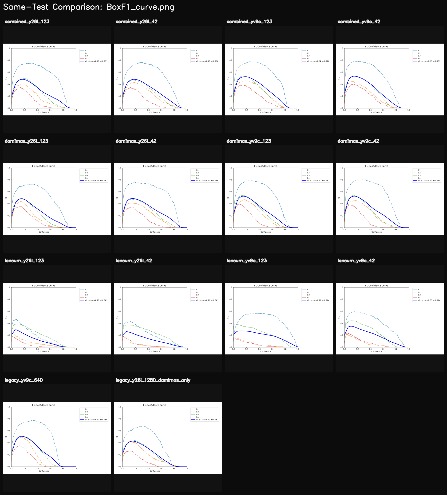

**Interpretasi:**
- Kurva F1 menunjukkan keseimbangan precision-recall pada berbagai threshold confidence
- Model Combined dan DAMIMAS v2 memiliki puncak F1 lebih tinggi dan lebih lebar
- Model LONSUM memiliki kurva F1 yang jauh lebih rendah dan sempit
- B1 (biasanya kurva paling atas) konsisten menjadi kelas terbaik

### 7.2 Grid PR Curve — Semua Model

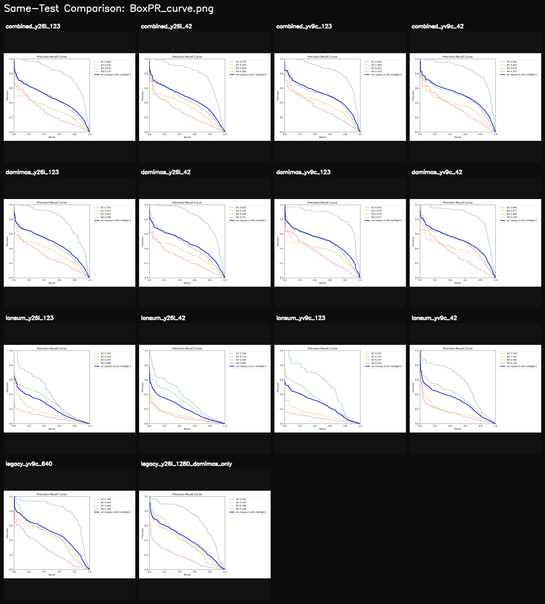

**Interpretasi:**
- Area di bawah kurva PR = mAP50
- Combined/DAMIMAS YOLOv9c memiliki area terluas
- B4 (kurva terbawah) menunjukkan trade-off precision-recall yang sangat terbatas
- LONSUM menunjukkan kurva PR yang sangat dangkal di semua kelas

### 7.3 Grid Confusion Matrix Ternormalisasi

**Interpretasi:**
- Diagonal yang lebih gelap/tinggi = performa lebih baik
- Baris "background" di bawah menunjukkan seberapa banyak objek yang terlewat (miss)
- Model Combined/DAMIMAS v2: diagonal B1 dominan (0.70–0.78)
- Model LONSUM: kolom background sangat dominan (banyak miss)

---

## 8. Visualisasi Prediksi

### 8.1 Grid Prediksi Batch 0

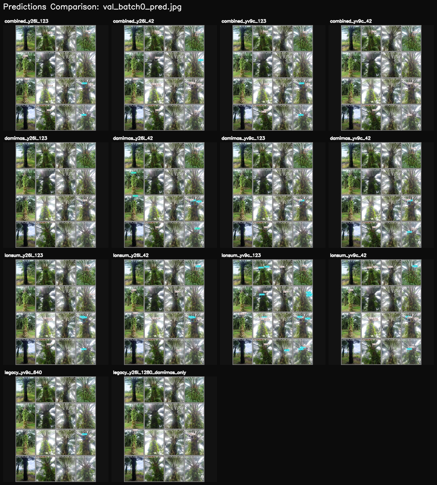

### 8.2 Grid Prediksi Batch 1

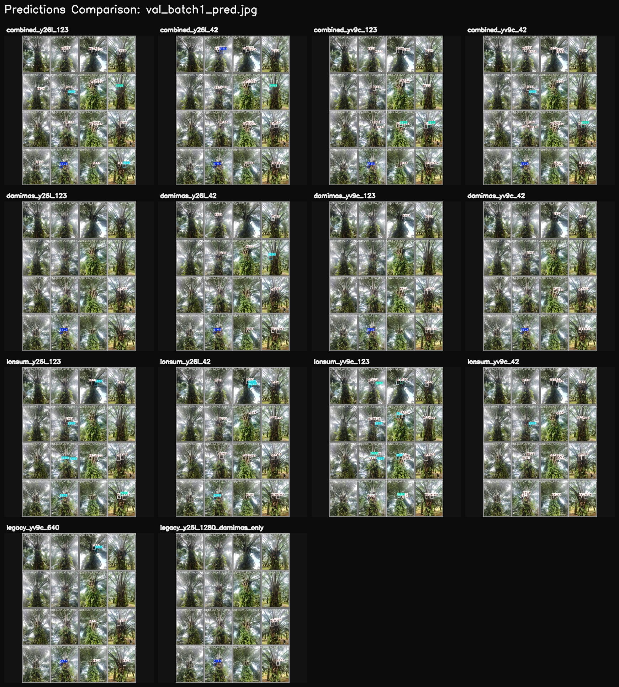

### 8.3 Grid Prediksi Batch 2

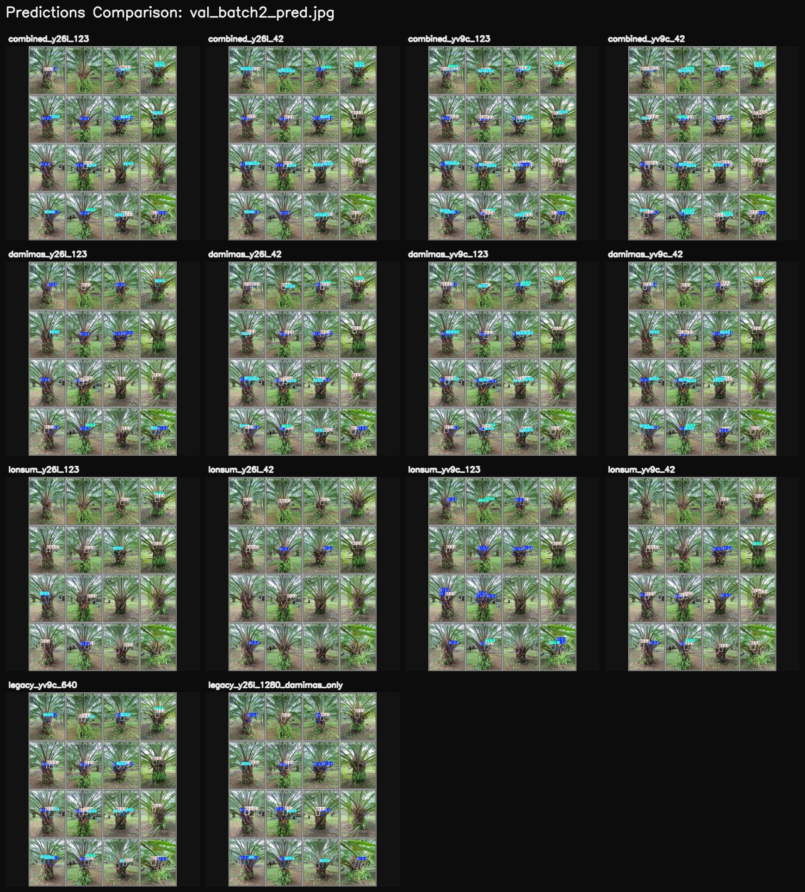

### 8.4 Master Canvas — Perbandingan Visual Per Gambar

**Canvas ini menampilkan 8 gambar test yang sama, diprediksi oleh semua 14 model secara berdampingan.**

### 8.5 Canvas Per Gambar (Detail)

| # | Gambar Test | GT Boxes | B1 | B2 | B3 | B4 |
|---|------------|----------|-----|-----|-----|-----|
| 1 | DAMIMAS_A21B_0551_3 | 8 | 1 | 2 | 4 | 1 |
| 2 | DAMIMAS_A21B_0490_4 | 8 | 2 | 1 | 1 | 4 |
| 3 | DAMIMAS_A21B_0497_4 | 8 | 1 | 1 | 5 | 1 |
| 4 | DAMIMAS_A21B_0275_3 | 8 | 2 | 4 | 1 | 1 |
| 5 | DAMIMAS_A21B_0716_1 | 8 | 1 | 1 | 4 | 2 |
| 6 | DAMIMAS_A21B_0749_1 | 8 | 2 | 1 | 4 | 1 |
| 7 | DAMIMAS_A21B_0551_4 | 8 | 2 | 2 | 3 | 1 |
| 8 | DAMIMAS_A21B_0551_2 | 8 | 2 | 2 | 2 | 2 |

Detail canvas per gambar tersedia di: `compare_same_test/canvases/`

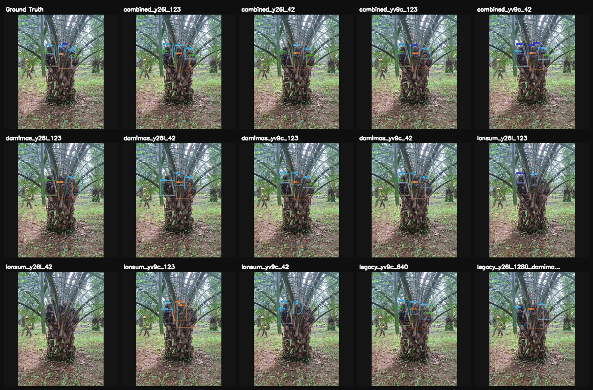
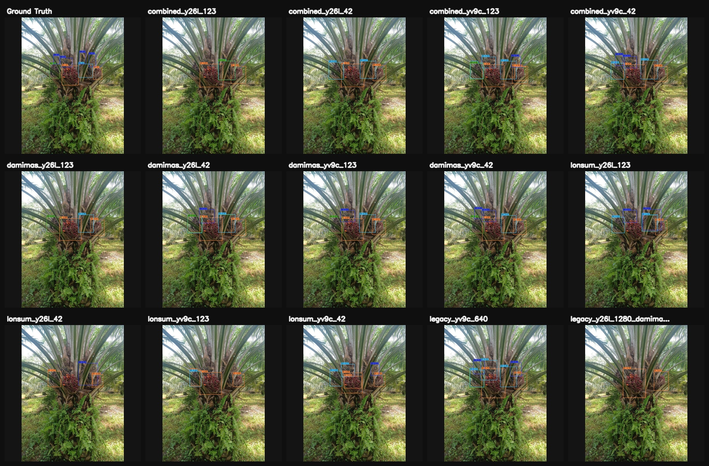
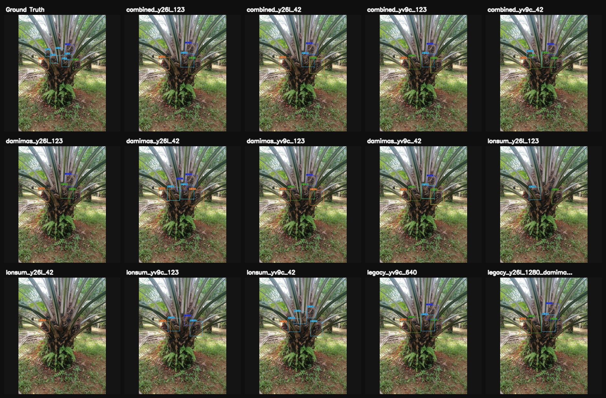
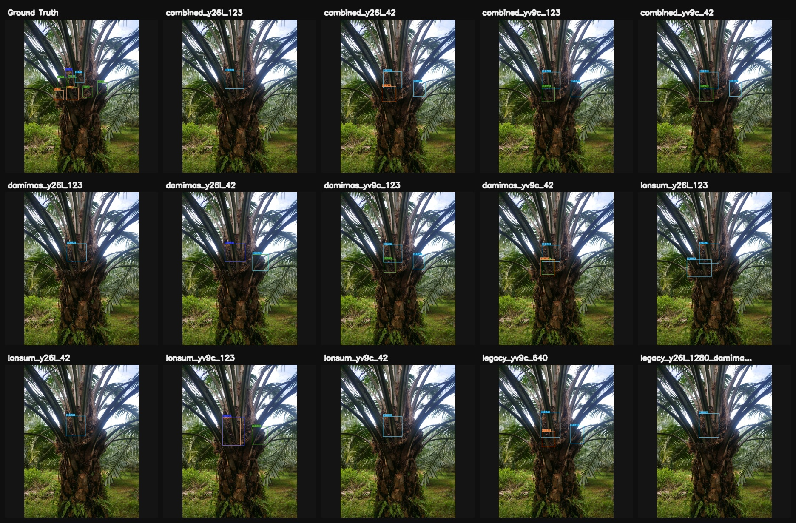
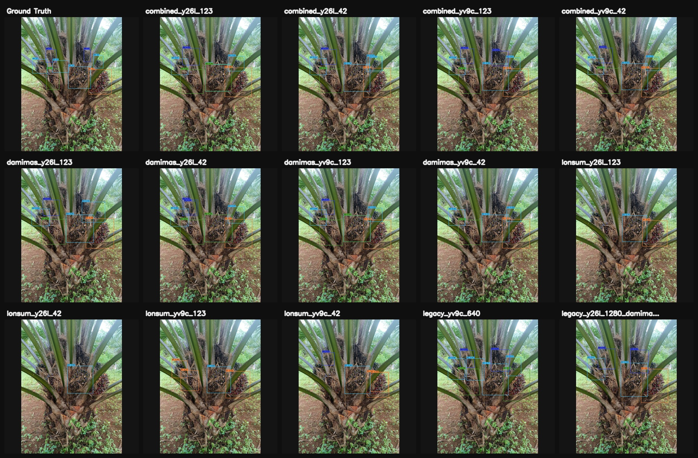
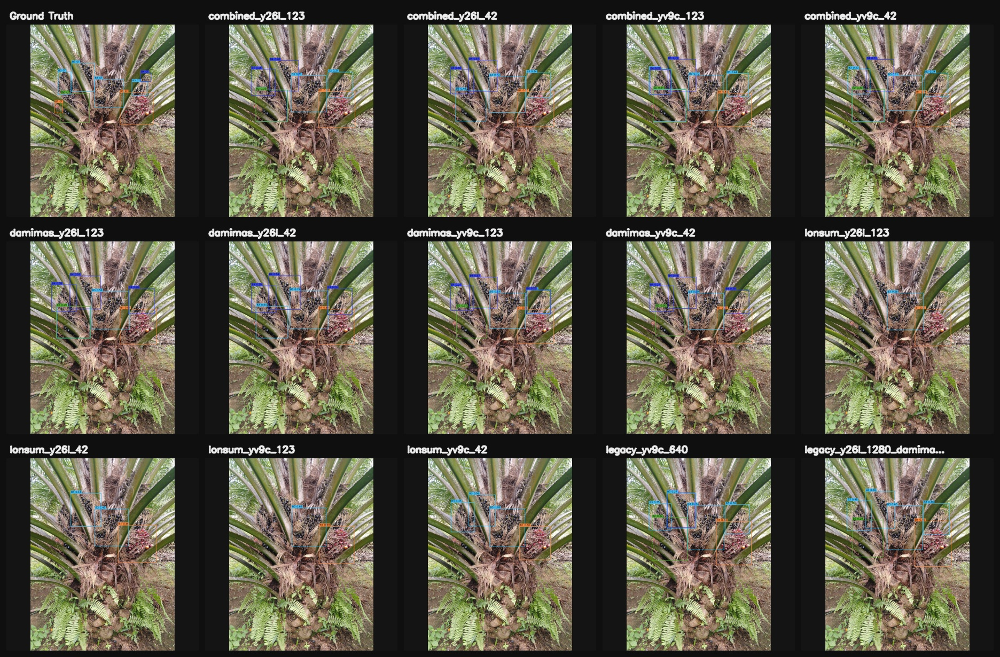
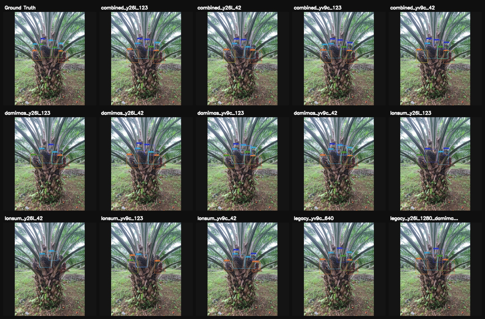
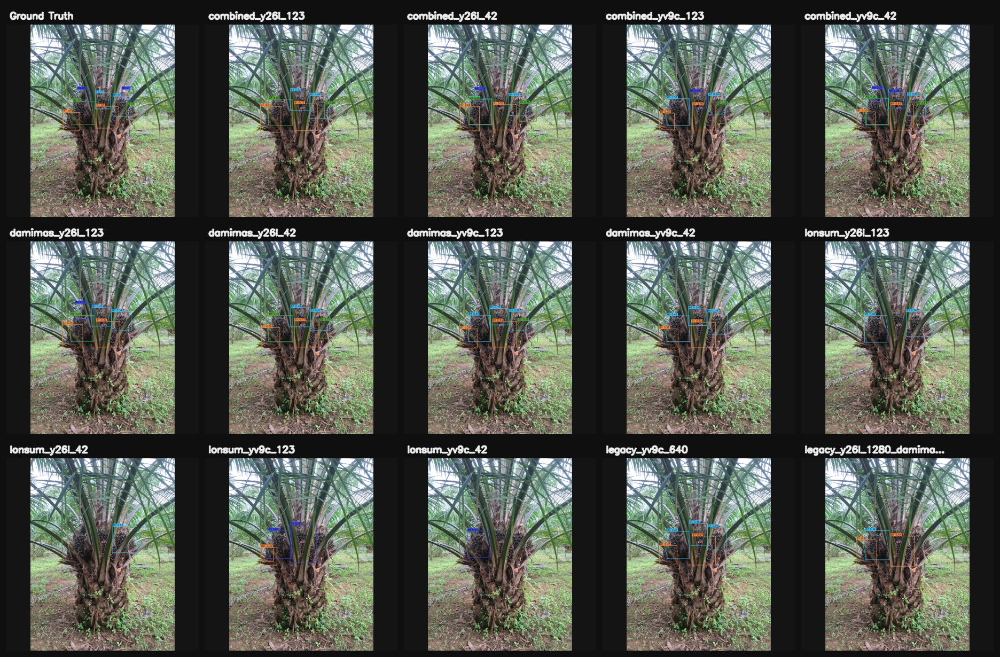

---

## 9. Kesimpulan dan Rekomendasi

### 9.1 Temuan Utama

1. **Model terbaik overall:** `combined_yv9c_123` dan `damimas_yv9c_42` (mAP50 = 0.505, mAP50-95 = 0.230)

2. **YOLOv9c > YOLO26L:** Secara konsisten di semua grup, YOLOv9c menghasilkan mAP50 ~4–5% lebih tinggi

3. **v2 > Legacy:** Peningkatan paling signifikan pada mAP50-95 (+43%), menunjukkan bounding box lebih presisi

4. **DAMIMAS ≈ Combined:** Model yang dilatih hanya pada DAMIMAS setara dengan model gabungan — data DAMIMAS sangat representatif

5. **LONSUM gagal generalisasi:** Model LONSUM memiliki domain gap besar terhadap test set gabungan (mAP50 hanya 0.21–0.31)

6. **Hierarki kesulitan per kelas: B1 >> B3 > B2 > B4**
   - B1: recall 0.70–0.80 (mudah)
   - B3: recall 0.33–0.48 (sedang)
   - B2: recall 0.21–0.38 (sulit, banyak confuse dengan B3)
   - B4: recall 0.02–0.28 (sangat sulit, sering hilang ke background)

### 9.2 Rekomendasi

| Prioritas | Rekomendasi | Alasan |
|-----------|-------------|--------|
| **Tinggi** | Gunakan `combined_yv9c_123` atau `damimas_yv9c_42` untuk deployment | Performa terbaik secara keseluruhan |
| **Tinggi** | Fokus perbaikan pada deteksi B4 | Recall hanya 0.28 — mayoritas pohon kecil tidak terdeteksi |
| **Sedang** | Perbaiki diferensiasi B2 vs B3 | Banyak salah klasifikasi antar kedua kelas ini |
| **Sedang** | Tambah augmentasi untuk objek kecil (B4) | Mosaic, copy-paste augmentation bisa membantu |
| **Rendah** | Investigasi domain gap LONSUM | Jika deployment di area LONSUM, perlu data lebih banyak atau fine-tuning |

### 9.3 Catatan Seed

- Perbedaan antar seed (42 vs 123) relatif kecil (±1–2% mAP50)
- Seed tidak menjadi faktor dominan — arsitektur dan dataset jauh lebih berpengaruh
- Untuk reproducibility, seed 123 sedikit lebih konsisten pada arsitektur YOLOv9c

---

*Laporan ini dihasilkan dari evaluasi pada dataset `dataset_combined_test` (592 gambar). Semua gambar dan kurva tersedia di direktori `Test/`.*
