# Analisis Mendalam `dataset_640`

## 1. Ringkasan Eksekutif

Laporan ini menganalisis `dataset_640` secara menyeluruh — bukan hanya menghitung distribusi split, tetapi juga menggali pola tersembunyi yang memengaruhi performa model: ketimpangan sumber data, perbedaan geometri antar kelas, hubungan kemunculan bersama, dan domain shift antar kebun.

| Metrik | Nilai |
| --- | --- |
| Total image | 3.992 |
| Total instance (bounding box) | 17.949 |
| Image tanpa label | 83 |
| Total pohon (tree) | 953 |
| Kebocoran tree antar split | **0** (aman) |
| Resolusi | 640 × 853 |

---

## 2. Audit Integritas Data

> **Catatan:** Folder lokal `dataset_640` berisi split 2772 / 608 / 612, sedikit berbeda dari log v2 repo (2780 / 620 / 592). Laporan ini menggunakan folder lokal sebagai sumber kebenaran.

Hasil pengecekan:
- Semua image dan label file berpasangan dengan benar.
- Tidak ada pohon yang muncul di lebih dari satu split — **tidak ada data leakage**.
- 83 image tanpa label tetap diikutkan dalam analisis sebagai bagian distribusi nyata.
- Ditemukan dua protokol foto: **4-view** (908 pohon) dan **8-view** (45 pohon, semua dari DAMIMAS).

### 2.1 Komposisi Split

| Split | Image | Pohon | Instance | Image Kosong | Rata-rata Objek/Image | DAMIMAS | LONSUM |
| --- | --- | --- | --- | --- | --- | --- | --- |
| Train | 2.772 | 667 | 12.426 | 57 | 4,48 | 2.492 | 280 |
| Val | 608 | 142 | 2.825 | 13 | 4,65 | 548 | 60 |
| Test | 612 | 144 | 2.698 | 13 | 4,41 | 556 | 56 |

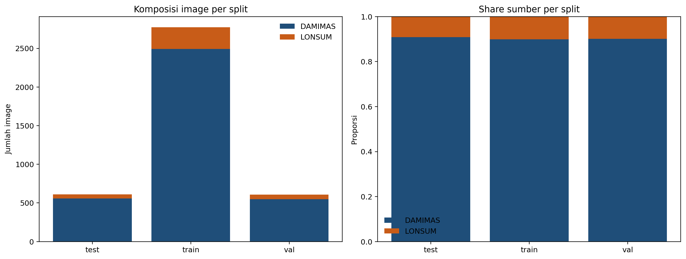

### 2.2 Distribusi Kelas

Empat kelas kematangan buah sawit (B1–B4) memiliki distribusi yang **tidak seimbang**: B3 mendominasi hampir setengah dari seluruh instance.

| Kelas | Instance | Proporsi | Muncul di (image) | Rata-rata Area BBox | Rata-rata Posisi Y |
| --- | --- | --- | --- | --- | --- |
| B1 (mentah) | 2.169 | 12,1% | 1.805 (45%) | 0,018 | 0,451 (bawah) |
| B2 (mengkal) | 4.078 | 22,7% | 2.435 (61%) | 0,014 | 0,427 |
| B3 (matang) | 8.270 | 46,1% | 3.536 (89%) | 0,013 | 0,380 |
| B4 (lewat matang) | 3.432 | 19,1% | 2.186 (55%) | 0,009 | 0,336 (atas) |

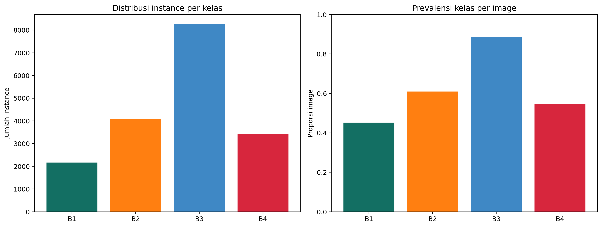

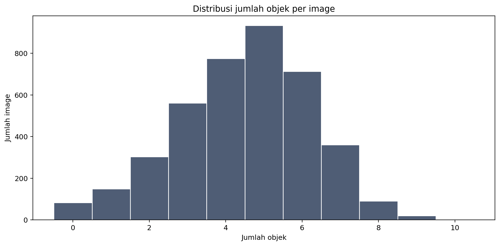

---

## 3. Temuan Utama

### 3.1 Ketimpangan Sumber Data (DAMIMAS vs LONSUM)

DAMIMAS mendominasi dataset secara masif: **90,1% image** dan **94,3% instance**. Akibatnya, model yang dilatih pada combined dataset sebenarnya hampir hanya belajar pola DAMIMAS.

| Sumber | Kelas | Instance | Proporsi di Sumber | Muncul di (image) | Area BBox | Posisi Y |
| --- | --- | --- | --- | --- | --- | --- |
| DAMIMAS | B1 | 2.152 | 12,7% | 1.790 (50%) | 0,018 | 0,451 |
| DAMIMAS | B2 | 3.924 | 23,2% | 2.325 (65%) | 0,014 | 0,428 |
| DAMIMAS | B3 | 7.593 | 44,9% | 3.211 (89%) | 0,013 | 0,382 |
| DAMIMAS | B4 | 3.254 | 19,2% | 2.057 (57%) | 0,009 | 0,336 |
| LONSUM | B1 | **17** | 1,7% | 15 (4%) | 0,012 | 0,432 |
| LONSUM | B2 | 154 | 15,0% | 110 (28%) | 0,009 | 0,392 |
| LONSUM | B3 | 677 | 66,0% | 325 (82%) | 0,008 | 0,365 |
| LONSUM | B4 | 178 | 17,3% | 129 (33%) | 0,006 | 0,337 |

Temuan penting:
- **B1 hampir tidak ada di LONSUM** — hanya 17 instance. Evaluasi transfer domain untuk kelas ini tidak adil.
- **LONSUM lebih jarang objek per image** (rata-rata 2,59 vs 4,71 di DAMIMAS). Ini bukan sekadar beda tampilan visual, tapi beda struktur scene.
- **JS distance komposisi kelas** DAMIMAS vs LONSUM = 0,237 — domain shift yang signifikan pada level prior kelas.

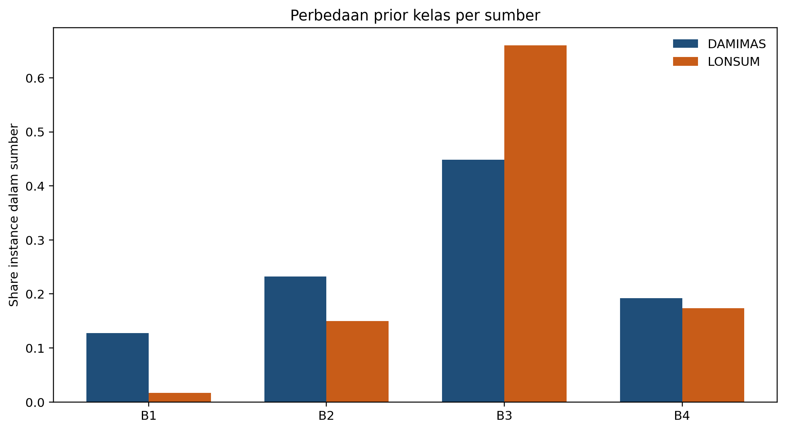

#### Drift per Kelas (Jensen-Shannon Distance)

| Metrik | B1 | B2 | B3 | B4 |
| --- | --- | --- | --- | --- |
| Area BBox | 0,437 | 0,264 | 0,280 | 0,221 |
| Posisi Y | 0,311 | 0,258 | 0,207 | 0,263 |

B1 menunjukkan drift paling besar pada kedua metrik — ukuran dan posisi buah B1 berbeda jauh antara dua kebun.

### 3.2 Pola Geometri: Ukuran dan Posisi Menentukan Kesulitan

Ada pola yang konsisten: **semakin matang buah, semakin kecil dan semakin tinggi posisinya di frame**.

| Kelas | Rata-rata Area BBox | Rata-rata Posisi Y | Kepadatan Image |
| --- | --- | --- | --- |
| B1 (mentah) | 0,0179 (terbesar) | 0,451 (terbawah) | 5,21 |
| B2 (mengkal) | 0,0140 | 0,427 | 5,19 |
| B3 (matang) | 0,0130 | 0,380 | 5,12 |
| B4 (lewat matang) | 0,0091 (terkecil) | 0,336 (teratas) | 5,40 (terpadat) |

Insight:
- **Ukuran objek lebih menentukan kesulitan deteksi daripada jumlah sampel.** B4 bukan kelas paling jarang, tapi paling sulit karena paling kecil.
- **B4 selalu muncul di image paling padat** (rata-rata 5,4 objek/image) — konteks yang paling ambigu untuk model.
- **Stratifikasi vertikal konsisten** — posisi Y bisa menjadi sinyal tambahan untuk separasi kelas.

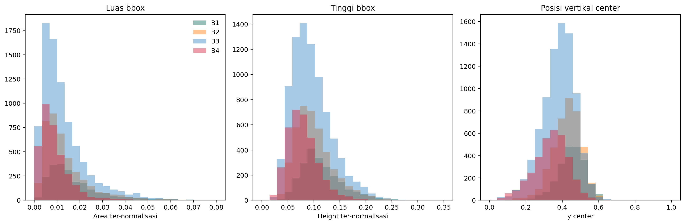

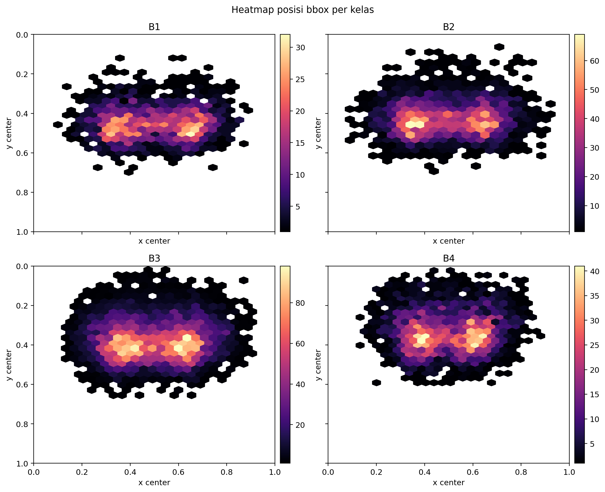

### 3.3 Hubungan Kemunculan Bersama (Co-occurrence)

Kelas-kelas tidak muncul secara independen. Kombinasi tersering menunjukkan bahwa **kebanyakan image berisi campuran 3-4 kelas sekaligus**.

| Kombinasi | Image | Proporsi |
| --- | --- | --- |
| B2 + B3 + B4 | 645 | 16,5% |
| B1 + B2 + B3 + B4 (lengkap) | 568 | 14,5% |
| B2 + B3 | 515 | 13,2% |
| B1 + B2 + B3 | 450 | 11,5% |
| B3 + B4 | 434 | 11,1% |

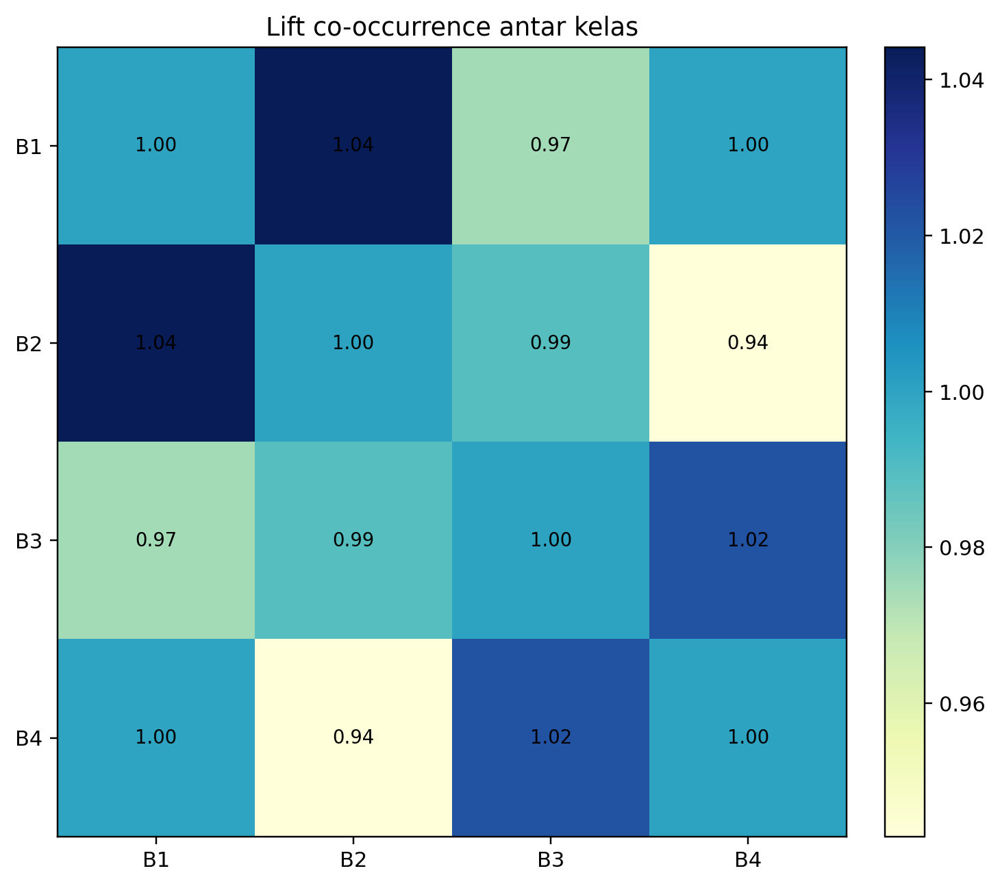

#### Asosiasi Berpasangan

| Pasangan | Image Bersama | Lift | Interpretasi |
| --- | --- | --- | --- |
| B1 ↔ B2 | 1.174 | **1,044** | Muncul bersama di atas ekspektasi acak |
| B3 ↔ B4 | 2.021 | 1,022 | Sering berdampingan |
| B2 ↔ B4 | 1.284 | **0,943** | Cenderung *tidak* muncul bersama |

### 3.4 Protokol Akuisisi: 4-View vs 8-View

| Protokol | Jumlah Pohon | Sumber |
| --- | --- | --- |
| 4-view (standar) | 908 | DAMIMAS + LONSUM |
| 8-view (diperluas) | 45 | DAMIMAS saja |

Seluruh pohon 8-view hanya berasal dari DAMIMAS. Protokol akuisisi terikat ke sumber data, sehingga berpotensi menjadi **confounder terselubung** — model mungkin belajar membedakan protokol foto, bukan kematangan buah.

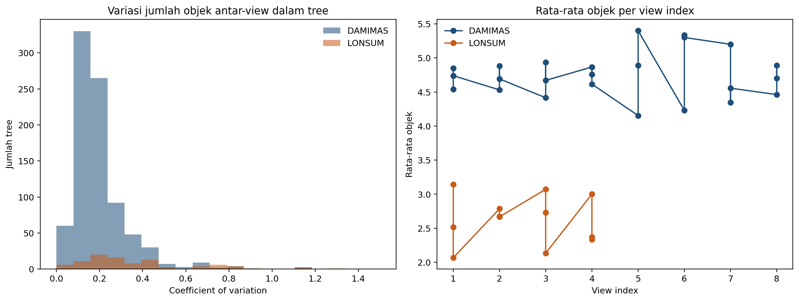

---

## 4. Separabilitas Visual (Embedding Analysis)

Embedding crop dihasilkan menggunakan ResNet50 dan divisualisasikan dengan t-SNE. Hasilnya menunjukkan bahwa **separasi kelas tidak merata**: kelas dengan sinyal ukuran dan posisi yang kuat (B1, B4) lebih mudah dipisahkan, sementara kelas tengah (B2, B3) saling tumpang tindih.

### 4.1 Linear Probe Accuracy

| Kelas | Precision | Recall | Akurasi Keseluruhan |
| --- | --- | --- | --- |
| B1 | **0,770** | **0,713** | 0,528 |
| B4 | 0,554 | 0,575 | 0,528 |
| B2 | 0,394 | 0,463 | 0,528 |
| B3 | 0,420 | 0,362 | 0,528 |

B1 paling mudah dipisahkan secara visual, B2 dan B3 paling sulit — sejalan dengan posisi mereka yang berdekatan di t-SNE.

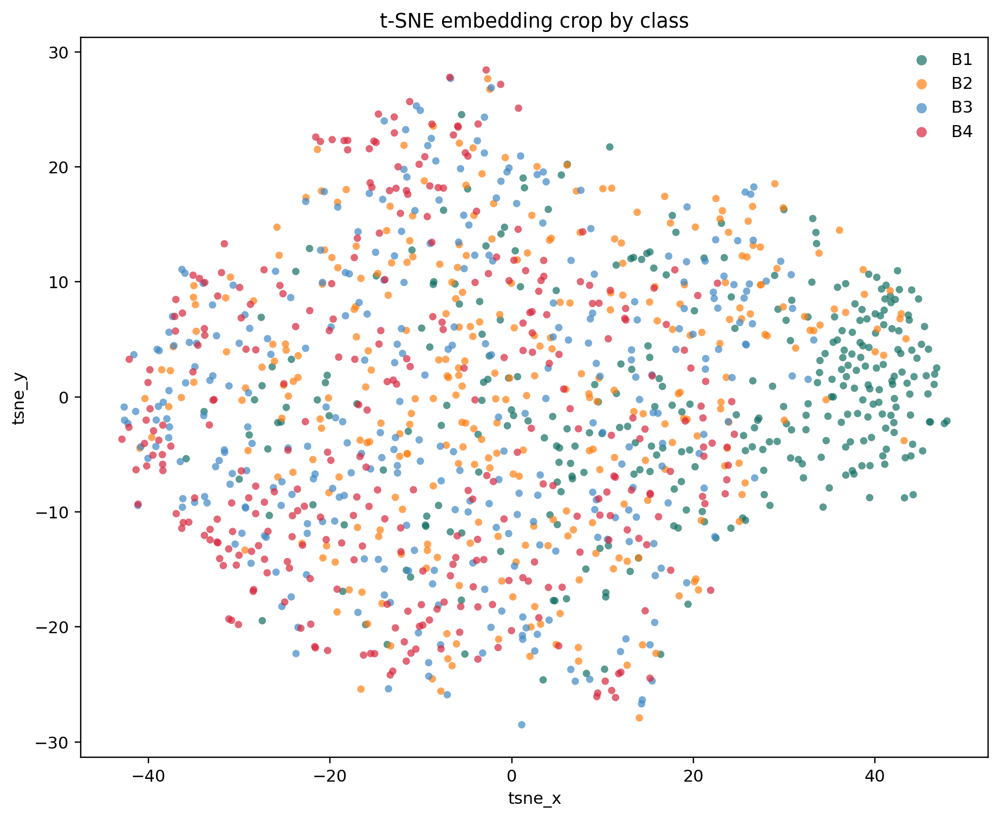

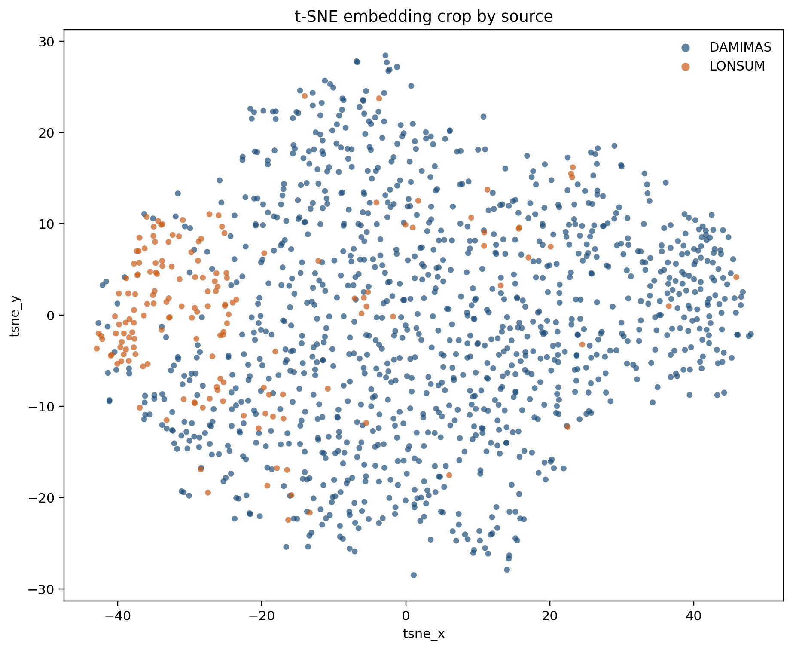

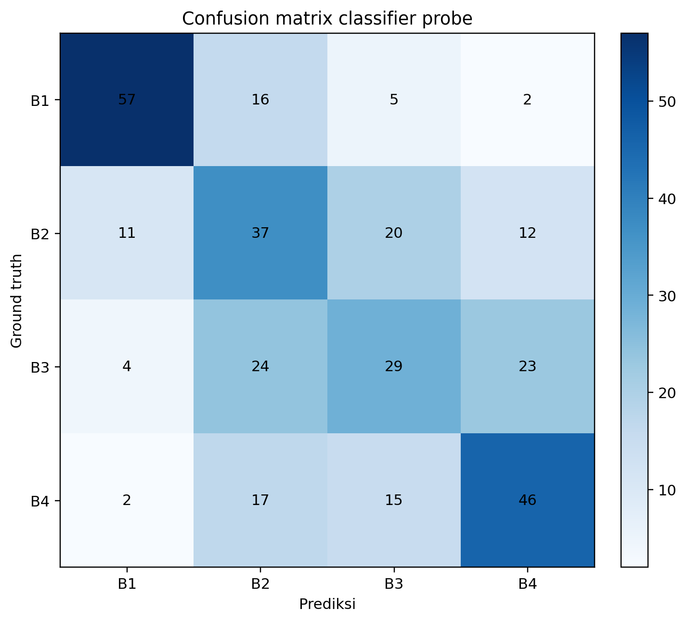

### 4.2 Cluster Internal Kelas

Setiap kelas memiliki sub-populasi internal yang kadang lebih terkait ke sumber data daripada ke label globalnya. Contoh: **B3 cluster 0** berisi 98,9% sampel dari DAMIMAS — satu label menyatukan mode visual yang berbeda.

| Kelas | Cluster | Sampel | Dominan Sumber | Share | Area BBox | Posisi Y |
| --- | --- | --- | --- | --- | --- | --- |
| B1 | 0 | 101 | DAMIMAS | 87,1% | 0,011 | 0,444 |
| B1 | 1 | 112 | DAMIMAS | 98,2% | 0,016 | 0,457 |
| B1 | 2 | 107 | DAMIMAS | 98,1% | 0,026 | 0,445 |
| B2 | 0 | 107 | DAMIMAS | 62,6% | 0,008 | 0,414 |
| B2 | 1 | 88 | DAMIMAS | 98,9% | 0,009 | 0,449 |
| B2 | 2 | 125 | DAMIMAS | 93,6% | 0,022 | 0,425 |
| B3 | 0 | 94 | DAMIMAS | **98,9%** | 0,020 | 0,384 |
| B3 | 1 | 113 | DAMIMAS | 60,2% | 0,006 | 0,367 |
| B3 | 2 | 113 | DAMIMAS | 97,3% | 0,010 | 0,396 |
| B4 | 0 | 106 | DAMIMAS | 94,3% | 0,011 | 0,324 |
| B4 | 1 | 103 | DAMIMAS | 64,1% | 0,004 | 0,346 |
| B4 | 2 | 111 | DAMIMAS | 94,6% | 0,009 | 0,345 |

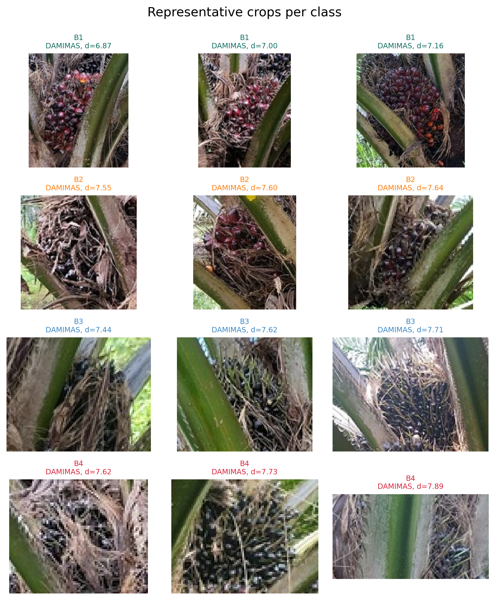

### 4.3 Outlier yang Perlu Diperiksa

Instance berikut memiliki jarak terjauh dari centroid cluster-nya — kandidat untuk audit anotasi.

| Kelas | Sumber | Split | View | Area BBox | Posisi Y | Jarak |
| --- | --- | --- | --- | --- | --- | --- |
| B1 | DAMIMAS | train | 6 | 0,033 | 0,534 | 17,05 |
| B1 | LONSUM | train | 1 | 0,002 | 0,330 | 14,66 |
| B1 | DAMIMAS | val | 4 | 0,012 | 0,508 | 13,89 |
| B2 | LONSUM | train | 1 | 0,001 | 0,170 | 15,33 |
| B2 | LONSUM | train | 1 | 0,001 | 0,254 | 14,06 |
| B2 | LONSUM | train | 3 | 0,004 | 0,330 | 14,00 |

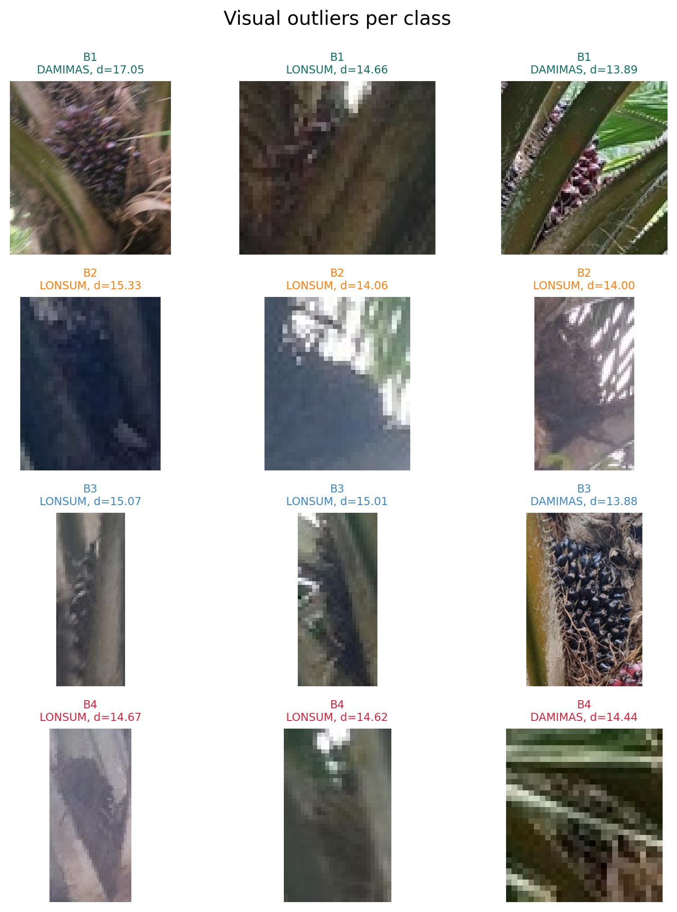

---

## 5. Kaitan dengan Performa Model

Apakah pola dataset ini terlihat di hasil training? **Ya.**

### 5.1 Performa per Skenario Data

| Skenario | Model | Run | mAP50 | mAP50-95 | Precision | Recall |
| --- | --- | --- | --- | --- | --- | --- |
| all_data | YOLOv9c | 2 | **0,504** | 0,228 | 0,484 | 0,599 |
| damimas_only | YOLOv9c | 2 | 0,502 | 0,227 | 0,492 | 0,601 |
| damimas_only | YOLO26l | 2 | 0,467 | 0,212 | 0,450 | 0,543 |
| all_data | YOLO26l | 2 | 0,459 | 0,209 | 0,449 | 0,537 |
| lonsum_only | YOLOv9c | 2 | 0,282 | 0,105 | 0,328 | 0,335 |
| lonsum_only | YOLO26l | 2 | 0,222 | 0,086 | 0,297 | 0,280 |

Menambahkan LONSUM ke data DAMIMAS **hampir tidak mengubah performa** (0,502 → 0,504) — karena LONSUM hanya 10% dari dataset.

### 5.2 Performa per Kelas

| Kelas | mAP50 | mAP50-95 | Precision | Recall | F1 |
| --- | --- | --- | --- | --- | --- |
| B1 (mentah) | **0,700** | 0,330 | 0,598 | 0,738 | 0,656 |
| B3 (matang) | 0,410 | 0,170 | 0,422 | 0,533 | 0,468 |
| B2 (mengkal) | 0,285 | 0,126 | 0,329 | 0,396 | 0,341 |
| B4 (lewat matang) | **0,229** | 0,085 | 0,318 | 0,264 | 0,285 |

Ranking kesulitan model **konsisten dengan pola dataset**:
- **B1 paling mudah** — ukuran terbesar, posisi paling jelas, embedding paling terpisah.
- **B4 paling sulit** — ukuran terkecil, image terpadat, bukan karena data kurang tapi karena objek inherently sulit.
- **B2 dan B3 saling bersaing** di tengah — embedding mereka tumpang tindih.

---

## 6. Rekomendasi

| Prioritas | Aksi | Alasan |
| --- | --- | --- |
| 1 | **Enrichment khusus B4**: close-up, QC anotasi, augmentasi skala | Kelas terkecil secara geometri dan paling sulit dideteksi |
| 2 | **Tambah data LONSUM untuk B1** | Hanya 17 instance — benchmark combined tidak seimbang untuk kelas ini |
| 3 | **Manfaatkan co-occurrence B1-B2** | Lift 1,044 — pasangan ini bisa jadi sinyal kontekstual untuk model |
| 4 | **Jangan hanya menambah jumlah sampel** | B1 sudah mudah meski sedikit; B4 butuh intervensi data-centric spesifik |
| 5 | **Pertahankan split per-tree** | Integritas sudah baik; fokus selanjutnya pada coverage source dan protokol view |
